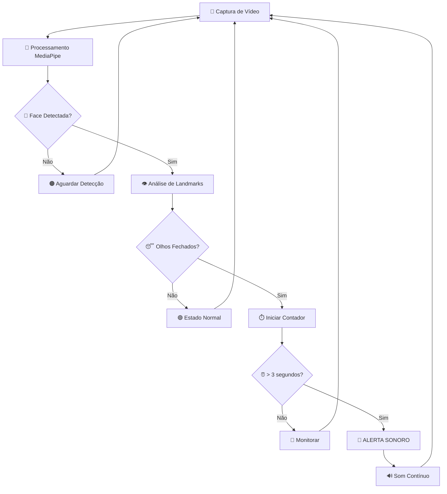

<div align="center">

# 💤 Detector de Sonolência com Alerta Sonoro


**Sistema inteligente de detecção de sonolência usando visão computacional**

*Previna acidentes e mantenha-se alerta com tecnologia avançada de detecção facial*

[🚀 Demo](#-demo) •
[📋 Instalação](#-instalação) •
[⚙️ Como Usar](#️-como-usar) •
[🔧 Configuração](#-configuração) •
[🤝 Contribuir](#-contribuindo)

</div>

---

## 🎯 **Sobre o Projeto**

> Este sistema utiliza **visão computacional** e **inteligência artificial** para detectar sinais de sonolência em tempo real, emitindo alertas sonoros quando os olhos permanecem fechados por tempo prolongado.

**Ideal para:**
- 🚗 **Motoristas** - Prevenção de acidentes por sonolência
- 📚 **Estudantes** - Manter foco durante estudos prolongados  
- 💼 **Profissionais** - Alerta durante trabalho noturno
- 🎮 **Gamers** - Evitar fadiga durante sessões longas

---

## ✨ **Características**

<div align="center">

| 🎥 **Detecção em Tempo Real** | 🔊 **Alerta Sonoro** | 🎨 **Interface Visual** | ⚡ **Performance** |
|:---:|:---:|:---:|:---:|
| Análise contínua da webcam | Som customizável e persistente | Feedback visual claro | Otimizado para baixo CPU |

</div>

### 🔥 **Funcionalidades Principais**

- ✅ **Detecção facial avançada** com MediaPipe
- ✅ **Monitoramento de landmarks oculares** em tempo real
- ✅ **Alerta sonoro configurável** (frequência e duração)
- ✅ **Interface visual intuitiva** com status colorido
- ✅ **Controle de threads** para performance otimizada
- ✅ **Compatibilidade multiplataforma** (Windows/Linux/Mac)

---

## 🛠️ **Stack Tecnológica**

```python
📦 Tecnologias Utilizadas:
├── 🐍 Python 3.7+          # Linguagem principal
├── 📷 OpenCV               # Processamento de vídeo
├── 🎯 MediaPipe           # Detecção de landmarks faciais  
├── 🔊 winsound            # Sistema de som (Windows)
├── 🧵 threading           # Controle de threads
└── 📐 math + time         # Cálculos e temporização
```

---

## 📋 **Instalação**

### **Pré-requisitos**
- Python 3.7 ou superior
- Webcam funcional
- Sistema operacional: Windows, Linux ou macOS

### **Instalação Rápida**

```bash
# Clone o repositório
git clone https://github.com/JoaoGuilhermeTeixeira/Detector-de-Exaust-o.git
cd detector-sonolencia

# Instale as dependências
pip install -r requirements.txt

# OU instale manualmente
pip install opencv-python mediapipe
```

### **requirements.txt**
```txt
opencv-python>=4.5.0
mediapipe>=0.8.0
numpy>=1.19.0
```

---

## ⚙️ **Como Usar**

### **Execução Simples**
```bash
python detector_sonolencia.py
```

### **Interface do Sistema**

<div align="center">

| Status | Cor | Descrição |
|:------:|:---:|:----------|
| 🟢 **OLHOS ABERTOS** | Verde | Estado normal - pessoa alerta |
| 🔴 **OLHOS FECHADOS** | Vermelho | Olhos detectados como fechados |
| 🚨 **DORMINDO X SEG** | Vermelho Intenso | **ALERTA ATIVO** - Sonolência detectada |
| 🟠 **NENHUMA FACE** | Laranja | Pessoa fora do campo de visão |

</div>

### **Controles**

```
⌨️  Teclas de Controle:
├── 'q' ou 'Q'    → Encerrar programa
└── 'ESC'         → Sair (alternativa)
```

---

## 🔧 **Configuração**

### **⏱️ Ajustar Sensibilidade**
```python
# Tempo para ativar alerta (em segundos)
if tempo >= 3:  # ← Altere este valor
    # Alerta ativado
```

### **🔊 Customizar Som**
```python
# Frequência e duração do alerta
winsound.Beep(2000, 3000)  # (Hz, millisegundos)
#             ↑     ↑
#        Frequência Duração
```

### **📐 Resolução da Câmera**
```python
# Ajustar resolução para performance
img = cv2.resize(img, (1000, 720))  # (largura, altura)
```

### **🎯 Limiar de Detecção**
```python
# Sensibilidade da detecção ocular
if distDi <= 10 and distEs <= 10:  # ← Ajuste estes valores
    # Olhos considerados fechados
```

---

## 🖥️ **Compatibilidade**

<div align="center">

| Sistema | Status | Observações |
|:-------:|:------:|:------------|
| 🪟 **Windows** | ✅ Completo | winsound nativo |
| 🐧 **Linux** | ⚠️ Parcial | Requer adaptação de som |
| 🍎 **macOS** | ⚠️ Parcial | Requer adaptação de som |

</div>

### **🔧 Adaptação para Linux/Mac**

```python
# Descomente para Linux/Mac
# import os
# os.system('speaker-test -t sine -f 2000 &')  # Linux
# os.system('say "Alerta de sonolência"')      # macOS
```

---

## 📊 **Como Funciona**



---

## 🚀 **Demo**

### **Estados do Sistema**

```
┌─────────────────────────────────────┐
│  🟢 OLHOS ABERTOS                   │  ← Estado Normal
│  Camera Ativa                       │
│  • • • •                           │  ← Landmarks dos olhos
└─────────────────────────────────────┘

┌─────────────────────────────────────┐
│  🔴 OLHOS FECHADOS                  │  ← Detecção iniciada
│  Camera Ativa                       │
│  — — — —                           │  ← Olhos fechados
└─────────────────────────────────────┘

┌─────────────────────────────────────┐
│  🚨 DORMINDO 5 SEG                  │  ← ALERTA ATIVO
│  Camera Ativa                       │
│  🔊 BEEP BEEP BEEP...              │  ← Som contínuo
└─────────────────────────────────────┘
```

---

## 📁 **Estrutura do Projeto**

```
detector-sonolencia/
├── 📜 detector_sonolencia.py    # 🧠 Script principal
├── 📚 README.md                 # 📖 Documentação
├── 📋 requirements.txt          # 📦 Dependências
├── 📄 LICENSE                   # ⚖️ Licença MIT
├── 🖼️ assets/                   # 🎨 Imagens e demos
│   ├── demo.gif
│   └── screenshots/
└── 📊 docs/                     # 📚 Documentação adicional
    ├── CONTRIBUTING.md
    └── CHANGELOG.md
```

---

## 🔍 **Troubleshooting**

<details>
<summary><b>❓ Problemas Comuns</b></summary>

### **🎥 Câmera não funciona**
```bash
# Verificar câmeras disponíveis
python -c "import cv2; print([i for i in range(5) if cv2.VideoCapture(i).read()[0]])"
```

### **🔊 Som não funciona no Linux**
```bash
# Instalar dependências de áudio
sudo apt-get install alsa-utils
```

### **⚡ Performance baixa**
```python
# Reduzir resolução
img = cv2.resize(img, (640, 480))  # Resolução menor
```

### **🎯 Detecção imprecisa**
- ✅ Melhorar iluminação do ambiente
- ✅ Posicionar rosto centralizado na tela  
- ✅ Ajustar limiar de detecção (valores 8-15)

</details>

---

## 🚀 **Roadmap**

- [ ] 🔊 **Som multiplataforma** automático
- [ ] 👥 **Detecção múltiplas faces** simultâneas  
- [ ] 🎨 **Interface gráfica** com configurações
- [ ] 📊 **Dashboard** com histórico de sonolência
- [ ] 📱 **Versão mobile** (Android/iOS)
- [ ] 🤖 **ML personalizado** por usuário
- [ ] ☁️ **Integração cloud** para relatórios
- [ ] 🌐 **API REST** para integração

---

## 🤝 **Contribuindo**

<div align="center">

**💡 Sua contribuição é muito bem-vinda!**

[Reportar Bug](../../issues) •
[Solicitar Feature](../../issues) •
[Fazer Fork](../../fork) •
[Pull Request](../../pulls)

</div>

### **Como Contribuir**

1. **🔀 Fork** o projeto
2. **🌿 Crie** uma branch para sua feature (`git checkout -b feature/nova-feature`)
3. **💾 Commit** suas mudanças (`git commit -m 'Adiciona nova feature'`)
4. **📤 Push** para a branch (`git push origin feature/nova-feature`)
5. **📋 Abra** um Pull Request

### **🏷️ Tipos de Contribuição**

- 🐛 **Bug fixes**
- ⭐ **Novas features**  
- 📚 **Documentação**
- 🎨 **Interface/UX**
- ⚡ **Performance**
- 🧪 **Testes**

---

## 📜 **Licença**

<div align="center">

**MIT License** © 2024

*Este projeto está sob a licença MIT. Consulte [LICENSE](LICENSE) para mais informações.*

[](https://opensource.org/licenses/MIT)

</div>

---

## 👨‍💻 **Autor**

<div align="center">

**Desenvolvido com ❤️ para promover segurança e bem-estar**

*Se este projeto foi útil, considere dar uma ⭐!*

</div>

---


</div>
